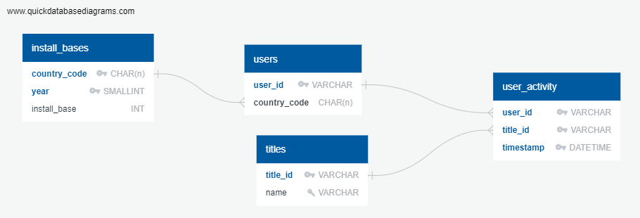

# Database Modelling Project

## 1. Project Overview

For this project, I was tasked with developing a methodology to estimate **Monthly Active Users (MAUs)** for individual video game titles across various global markets. This includes defining access rates, identifying what data points to extract from multiple API endpoints, and combining this data with internal sources to create accurate and scalable MAU estimates.

The challenge was to combine user activity data, title metadata, and platform install base statistics while accounting for privacy limitations and sampling biases. The overarching goal was to produce daily MAU estimates to support a wide range of reporting and analytical needs, including trend analysis and market comparisons.

My role involved:
- Planning the data extraction,
- Database design,
- Estimation methodology.

## 2. Challenges and Requirements

### Key Challenges:
- **API Limitations & Privacy Restrictions**: Data was available for only 1 in 4 users, due to privacy settings, making it difficult to capture a fully representative sample. This required careful planning of the sampling strategy and the frequency of data retrieval to maximize data coverage.
- **Time Zone Differences**: With gaming activity happening at different times in various countries, retrieving data at appropriate intervals was crucial. For accurate MAU estimates, the solution involved making multiple daily data requests, adjusted for different markets’ peak activity times.
- **Large-Scale Data Handling**: The database needed to process data for thousands of titles across dozens of markets. Scalability was essential to ensure that data retrieval, storage, and processing were efficient, while the results remained accurate.
- **Sampling Biases**: Given that not all users opted to share their activity data, developing a robust sampling strategy was critical. It involved applying stratified sampling techniques to ensure representative data collection across both geographic regions and genres.
- **Data Discrepancies**: At times, the MAU estimates produced by the system will differ from factual market data. It was important to respond to client concerns, reconcile differences, and adjust the estimation models as needed.

### Project Requirements:
- Modelling a database that could support real-time updates for MAU estimates..
- Ensuring the sampling strategy accounted for privacy restrictions and geographic diversity.
- Considering automated checks and testing to ensure data quality and accuracy before sharing results with clients.

## 3. Data Sources

The project needed to utilzie several API endpoints, alongside internal data sources, to estimate Monthly Active Users (MAUs) for individual game titles. Each data source played a crucial role in building a comprehensive understanding of user activity. The main data sources included:

- **User Activity Endpoint**: Provided information about what titles users were playing and when they were active. This endpoint returned a title_id if a user was currently playing a game or “Offline” if they were not. Due to privacy settings, this data was only available for about 25% of users, requiring careful sampling to ensure accurate estimations.
- **User Metadata Endpoint**: Contained user-specific data such as user_id, country_code, and creation_date. This was used to identify users’ countries and ensure accurate representation of different markets. The metadata was retrieved daily to account for new users joining the platform.
- **Title Metadata Endpoint**: Featured information on video game titles, such as title_id, name, genre, and release_date. This endpoint was essential for mapping user activity data to specific titles, and it helped categorize and filter games for MAU calculations.
- **Install Base Data**: : This internally available data provided yearly estimates of the active user base for each market, which was critical for scaling the sampled MAUs to population-wide estimates.

## 4. Approach and Solution
The approach to estimating Monthly Active Users (MAUs) for individual titles and markets involved several key phases, ranging from planning data extraction to the final calculation of estimates. Below is a breakdown of the process:

### 4.1 Data Extraction
The first step was to define which data to extract when from the available API endpoints. This involved the following actions:
- **User Activity Endpoint**: Data should be retrieved every 30 minutes to capture gaming sessions across different time zones and ensure adequate coverage of user activity. The extracted data included user_id and title_id, indicating which games users were playing at specific times.
- **User Metadata**: This data should be retrieved once a day to account for new users joining the platform. It included user_id and country_code, linking users to specific geographic markets.
- **Title Metadata Endpoints**: By pulling data daily, this endpoint provides information on new game releases and ensures that MAU estimates are linked to correct and up-to-date title information.
- **Internal Install Base Data**: Used to extrapolate the sampled MAUs to the population level for each country. The install base data provides the overall active user estimates for each market.
 
### 4.2 Database Design
A relational database was modeled to handle large volumes of data efficiently.

| Table Name     | Primary Key                      | Foreign Key                      | Constraints                          | Relationships                                                     |
| -------------- | -------------------------------- | --------------------------------- | ------------------------------------ | ------------------------------------------------------------------|
| `install_bases`| Composite key: country_code, year| N/A                               | install_base NOT NULL                | One-to-Many: Each country_code linked to many users               |
| `users`        | user_id                          | country_code references install_bases| N/A                               | One-to-Many: Each user can have multiple entries in user_activity |
| `titles`       | title_id                         | N/A                               | name UNIQUE, NOT NULL                | One-to-Many: Each title associated with multiple user_activity    |
| `user_activity`| Composite key: user_id, title_id, timestamp | user_id references users, title_id references titles | N/A | Many-to-One: Many activity records linked to a single user and title |



### 4.3 MAU Calculation Process
1. User activity data is filtered by timestamp to include only activity within the past 30 days. Any records marked as "Offline" are excluded.
2. The filtered user activity data is joined with the users table (to link users to their country) and the install_bases table (to obtain the install base for each market).
3. Sample and extrapolate MAUs based on the scaling factor for each country.
4. Unique user_ids are counted to determine the sample size for each country.
5. The install base for each country is divided by the sample size, producing a scaling factor.
6. The MAU for each game title in a market is calculated by multiplying the number of unique active users (in the sample) by the scaling factor, thereby estimating the MAU for the entire market.

7. Use SQL queries for data extraction, sampling, and scaling:
```sql
WITH recent_activity AS (
  SELECT ua.user_id, ua.title_id, ua.timestamp, t.name, u.country_code
  FROM user_activity AS ua
  JOIN titles AS t ON ua.title_id = t.title_id
  JOIN users AS u ON ua.user_id = u.user_id
  WHERE ua.timestamp >= NOW() - INTERVAL '30 days'
    AND ua.title_id != 'Offline'
)
-- Additional SQL steps to calculate MAU
-- Step 1: Join user_activity table to titles table, filtering by timestamp (last 30 days) and excluding 'Offline'
WITH recent_activity AS (
    SELECT ua.user_id, ua.title_id, ua.timestamp, t.name, u.country_code
    FROM user_activity AS ua
    JOIN titles AS t ON ua.title_id = t.title_id
    JOIN users AS u ON ua.user_id = u.user_id
    WHERE ua.timestamp >= NOW() - INTERVAL '30 days'
      AND ua.title_id != 'Offline'
),

-- Step 2: Join recent_activity with install_bases to get the install base for the country and year
activity_with_install_base AS (
    SELECT ra.user_id, ra.title_id, ra.name, ra.country_code, ib.install_base
    FROM recent_activity AS ra
    JOIN install_bases ib ON ra.country_code = ib.country_code
    WHERE ib.year = EXTRACT(YEAR FROM NOW()) -- assuming you want the current year's install base
),

-- Step 3: Calculate sample size per country and scaling factor
sample_sizes AS (
    SELECT country_code, COUNT(DISTINCT user_id) AS sample_size
    FROM activity_with_install_base
    GROUP BY country_code
),

-- Step 4: Calculate the scaling factor for each country
scaling_factors AS (
    SELECT ss.country_code, ib.install_base, ss.sample_size, 
           (ib.install_base::DECIMAL / ss.sample_size) AS scaling_factor
    FROM sample_sizes AS ss
    JOIN install_bases ib ON ss.country_code = ib.country_code
    WHERE ib.year = EXTRACT(YEAR FROM NOW())
),

-- Step 5: Calculate the MAU for each game in each country
mau_per_title AS (
    SELECT awib.country_code, awib.title_id, awib.name, COUNT(DISTINCT awib.user_id) AS sample_mau,
           sf.scaling_factor, 
           (COUNT(DISTINCT awib.user_id) * sf.scaling_factor) AS final_mau_estimate
    FROM activity_with_install_base AS awib
    JOIN scaling_factors AS sf ON awib.country_code = sf.country_code
    GROUP BY awib.country_code, awib.title_id, awib.name, sf.scaling_factor
)

-- Step 6: Calculate margin of error for the estimates
SELECT mt.country_code, mt.title_id, mt.name, mt.sample_mau, mt.final_mau_estimate,
       -- Margin of error calculation
       1.96 * SQRT((mt.sample_mau / sf.sample_size) * (1 - (mt.sample_mau / sf.sample_size)) / sf.sample_size) AS margin_of_error
FROM mau_per_title AS mt
JOIN scaling_factors AS sf ON mt.country_code = sf.country_code
ORDER BY mt.country_code, mt.title_id;
```

#### Possible Improvements
Given enough time, data on the minimum consistent MAU (MCMAU) per month and per region should be gathered. A different scaling factor should then be recalculated for each month of the year and for every market using these MCMAU values instead of the install base data, as in our defined approach above we are calculating the scaling factor by comparing monthly data to yearly install bases. Additionally, it is almost impossible that a full install base would be active in a month, so using this estimate is further introducing biases to our estimates.

### 4.4 Sampling Strategy
When selecting a sampling method to estimate Monthly Active Users (MAUs) with limited data access, we considered both **stratified sampling** and **cluster sampling**. The key considerations were the need to achieve a representative sample while managing the limitations imposed by incomplete user activity data.
- **Cluster Sampling** was initially considered but deemed less suitable due to the heterogeneous nature of the clusters (e.g., country, title, or genre). In cluster sampling, entire groups (clusters) are sampled, but if the clusters are highly varied internally, it can lead to inaccurate results and higher sampling errors. Since user behavior across different countries, titles, and genres is expected to be highly diverse, clustering would not adequately capture this variability.
- **Stratified Sampling** was chosen as the preferred method because it allows for more accurate representation across key demographic and behavioral categories. In stratified sampling, the population is divided into distinct subgroups (strata) based on factors like country, title, or genre. A random sample is then taken from each stratum, ensuring that each subgroup is proportionally represented in the final sample.

#### Why Stratified Sampling?
- Stratified sampling ensures representativity across various factors like country, title, and genre.
- **Country**: Install base data was used to determine the sample size per country for more accurate estimates.
- **Genre**: Sampling by genre within each market ensured a balanced representation of game types across geographic regions.

#### Example of Stratified Sampling:
- **Define Sample Size:**
  - Let’s say we will look at data for **10,000 users** who have activity data in our intended period.

- **Definition of strata:**
  - **Country**: We have install base information at the country level already, so we can use this information to determine the proportion of users we should sample for each country by comparing the total install base to each country’s. This strives for representativity across geography.
    - **Example**: Market A has 30% of the platform's install base, so we assign **3,000 users** (30% of 10,000) to this market.
  
  - **Title or Genre**: By grouping our user activity by title or genre within each country, we can additionally identify the most and least popular genres in each country and determine the proportion we should sample from each genre. This strives for representativity across different kinds of titles. 
    - It would be best to group by **genre** because grouping by title will be too restrictive due to the large number of titles, many of which will not have enough data for an adequate sample size. Genre, while still ensuring a broad representation of playing habits, allows us to have a less restrictive filter and higher sample sizes for these strata in each market.
    - **Example**: Genre X in Market A (which we attributed 3,000 users to) is played by 20% of Market A users. We assign **600 users** (20% of 3,000) to this genre in this market.

- **Random Sampling:**
  - Now we randomly sample active users during the intended study period according to the allotted country and genre proportions.

- **Optional Weighting of Data:**
  - If, during the study period, we do not have enough user activity data for a specific market/genre combination to match our defined proportions, we may apply **weighting** to the data in that genre or market to more accurately match our desired proportions.
  - However, this is typically a **complex and lengthy process**, especially when considering multiple genres across several markets. It may also introduce increased **variance** in estimates, particularly for very small sample sizes.


## 5. Anticipating Challenges
During the project, it was necessary to anticipate challenges that would require troubleshooting and careful problem-solving. The most significant challenges are outlined below, along with the steps suggested to resolve them:

### 5.1 Query Performance Issues
As the dataset grows, some SQL queries may run slower than expected, delaying analysis and updating of MAU estimates. Optimizing the database will be essential to ensure timely delivery of daily reports. Suggested steps were:
- **Partitioning**: To handle large datasets more efficiently, partitioning was considered for the user_activity table. A dynamic range partition by timestamp should improve performance for queries focused on the last 30 days, which is the common use case for MAU estimation.
- **Caching and Archiving**: Frequently accessed results may be cached to reduce query times for routine tasks. Older, less frequently accessed data should be archived, reducing the size of the active tables and improving query performance.

### 5.2 Data Discrepancies and Client Feedback
At times, discrepancies may arise between the MAU estimates produced and internal client data. When clients report significant deltas between the estimates and their internal figures, the following steps should be taken:
- **Collaborative Investigation**: Engaging with the clients to better understand their data sources, estimation methods, and assumptions. This will help identify potential sources of divergence, such as differences in time frames, sample sizes, or demographic factors.
- **Adjusting the Model**: In some cases, the estimation model should be adjusted based on new insights from the clients. For example, market-specific factors or changes in install base assumptions may be incorporated to align the estimates more closely with the client’s internal data.
- **Improved Communication**: A structured response process should bes implemented to handle client queries. This would involve thanking the client for their feedback, explaining the investigation process, and providing potential reasons for the discrepancy. Open communication will help foster trust and allow for continuous improvement of the estimates.

### 5.3 Ensuring Data Quality
As the estimates should be updated daily, maintaining data quality is critical. A multi-step validation process should be implemented before sending the monthly datasets to clients:
- **Scheduled Data Retrieval**: Data should be retrieved from the API endpoints at regular intervals using scheduled tasks, ensuring timely updates to the MAU estimates.
- **Automated Data Tests**: Automated tests should be set up to validate field types, ensure referential integrity (e.g., foreign keys), and enforce constraints such as uniqueness and non-null values. Using dbt for versioning and ETL/ELT processes was my suggestion.
- **Descriptive Statistics and Outlier Detection**: Descriptive statistics should be automatically generated to compare new estimates against previous data and internal benchmarks. Outliers should be identified using methods such as Z-scores and interquartile range (IQR), and any anomalies flagged for further investigation.
- **Automated Alerts**: In case of data extraction errors (e.g., API request failures or missing fields), an automated alert system should be set up to notify the team. This would allow for quick resolution of issues before they could affect the dataset's quality.
  - **Date and Time Validation**: Ensuring that date fields were within the expected range (e.g., no dates in the future or outside of the 30-day window for MAU estimates).
  - **Country Code Format**: Verifying that all country codes followed the ISO format, ensuring consistent market-level data.
  - **ID Validations**: Ensuring that all user_id and title_id fields were in the correct format, with no duplicates or invalid entries.
  - **Range checking**: Checking that user activity aggregated data and MAU estimates values are both below install base values and non-negative

- **Version Control and Documentation**: Each dataset should be versioned, and any changes or corrections made during the QA process should be documented. This ensures full traceability and transparency in case of any issues arising after client delivery.
- **Cross-Team Validation**: In addition to automated checks, more than one team member should review the dataset to catch any potential blind spots of the main responsible. This peer review process helps ensure that all datasets meet the quality standards before being sent to clients.

## 6. Conclusion and Key Takeaways

The successful completion of this project resulted in the development of an accurate and scalable method for estimating Monthly Active Users (MAUs) for individual game titles across a wide range of markets. By leveraging multiple API endpoints, internal install base data, and a robust sampling strategy, I was able to provide stakeholders with actionable insights into how to obtain the desired player behavior data across multiple games and regions.

### Key Takeaways:
- **Scalable Data Pipeline**:The database was modelled to handle large volumes of data across thousands of titles and markets, ensuring that daily MAU estimates could be delivered reliably and efficiently.
- **Sampling Strategy and Data Accuracy**: Despite privacy restrictions limiting access to 25% of user activity data, the use of stratified sampling and careful extrapolation ensured that the estimates were representative of the broader population. Regular quality checks and peer reviews further ensured data accuracy.
- **Query Optimization and Automation**: Query performance challenges were addressed through optimization techniques, including indexing and data partitioning. Automating many aspects of the data retrieval and testing process not only reduced manual effort but also improved the overall efficiency of the monthly reporting workflow.
- **Collaboration and Client Feedback**:Open communication with clients helped resolve data discrepancies and improve the estimation model, reinforcing the importance of flexibility and collaboration when working with real-world data.

This project demonstrated the value of thoughtful data modeling, careful sampling strategies, and the importance of continuous process improvement. The ability to adapt to challenges, optimize for performance, and ensure data accuracy through automation ultimately provided a reliable solution that could support both business objectives and client needs.

